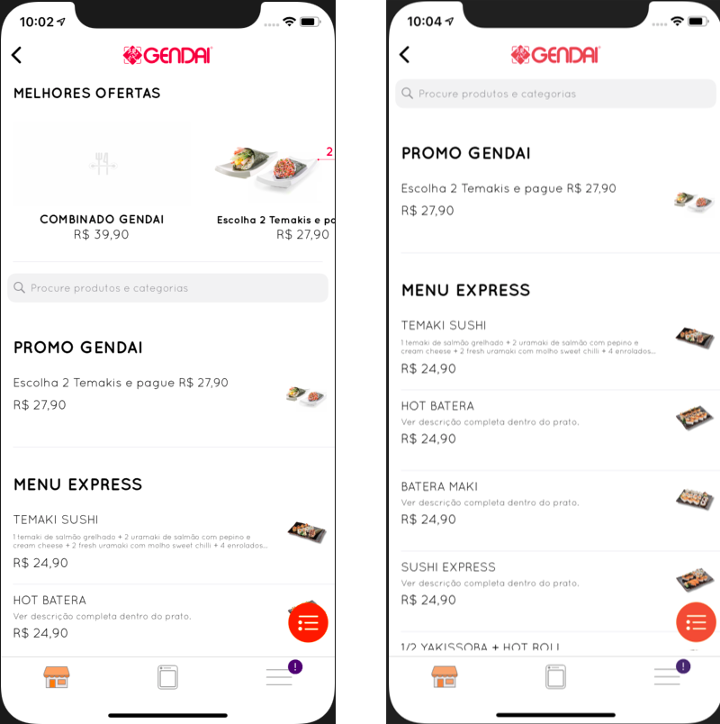

# Onyo iOS Challenge #

The main goal of the challenge is to create an iOS app to fetch the API information of company products and show them according to the provided screenshot.

### **API** ###

Retrieve company products: [https://api.staging.onyo.com/v2/mobile/company/121/products](https://api.staging.onyo.com/v2/mobile/company/121/products)
Retrieve company product categories: [https://api.staging.onyo.com/v1/mobile/company/121](https://api.staging.onyo.com/v1/mobile/company/121)

### **Must have** ###

* Customized UINavigationBar
* Product list, aggregated by category (follow relevant parts of the design on the provided screenshots)
* Asynchronous and on demand image loading
* Dependency management system (CocoaPods, Gradle, ...)
* Minimum iOS version 10.0
* Swift 4.2
* API Communication Framework (Alamofire, ...)
* Asynchronous and on demand image loading with cache Framework (SDWebImage, Alamofire, Fast Image Cache, ...)
* Code in a VCS repository

### **Bonus* ###

* Best offers carrousel
* Search field by products and categories
* Customized tabs
* ORM Framework (CoreData, Realm, MagicRecord, ...)
* Unit Testing (XCTest, KIF, Kiwi, Quick, ...)
* Functional tests (Appium, UIAutomation, ...)

*The frameworks are just a suggestion. You can use any other frameworks and _surprise us_!*

### **Submission Process** ###

* The candidate must implement the app, fill [this form](TODO) and notify us via e-mail.
