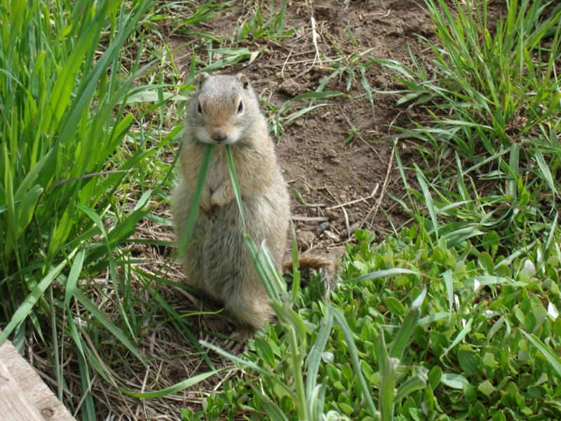
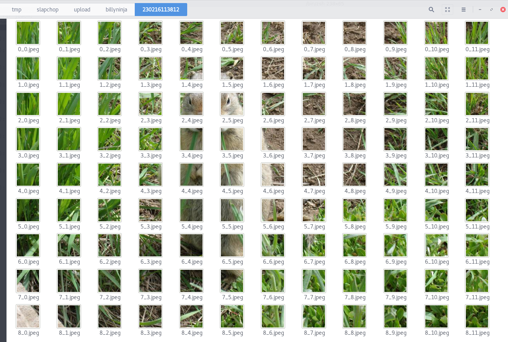

## Silly Idea
Upload images to a service. The service will split the image in *tiles*, and provide a reference to a shuffled sequence of these tiles, where the users can provide solutions to this *puzzle*.

The [**Slapchop**](https://github.com/billyninja/slapchop) service acts as an upload front-end, with image handling functionalities, as well as a fileserver for delivering the uploaded images (just because it was easy to do so, instead of through a reverse proxy setup).

Every image uploaded to Slapchop may be subsequentially posted to [**Puzzler**](https://github.com/billyninja/slapchop) project, *if* the *-puzzler* flag is setted in the *Slapchop* project. If that's the case, the `POST /chopit` response will retrieve a *puzzle_href* and *solution_href* fields.

## USAGE

###PUZZLER
`pip install requirements.txt`

`python manage.py migrate`

`python manage.py createsuperuser`

`python manage.py runserver localhost:8001`

###SLAPCHOP

`go get github.com/billyninja/slapchop`

`cd $GOPATH/src/github.com/billyninja/slapchop`
`go build .`

`./slapchop -port=9000 -puzzler=username:pwd@localhost:8001`

>**NOTE**: You can pick whichever ports you want for slapchop and puzzler settings.

`curl -F "uploadfile=@/home/joaom/Pictures/teste.jpeg" localhost:9000/chopit/yourusername`

> **NOTE**: you can provide ANY username that the slapchop system will accept, so there's no authentication system in place. **BUT** I persisted the intial DRF basic auth on Puzzler service, so you'll need credetials for that.
